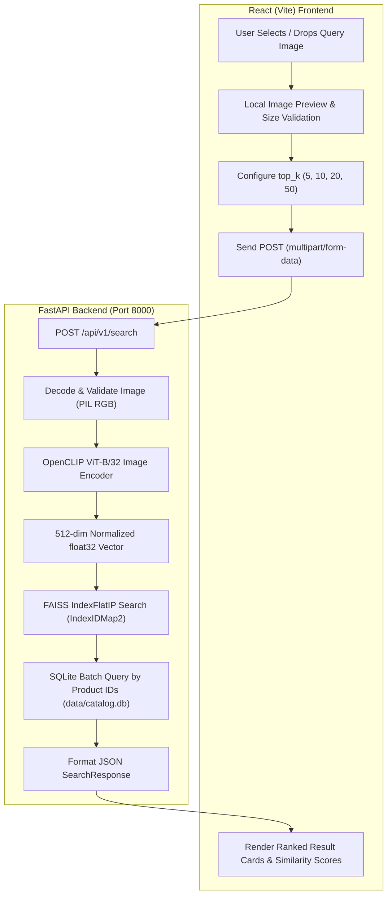

# Visual Product Search — Week 2 Progress

## 1. Week 2 Overview

Week 2 shifted the project from the Week 1 catalog ingestion foundation (2,000 catalog products indexed into SQLite and FAISS vector indices) into a functional, end-to-end visual similarity search application. 

During this milestone, a production-grade FastAPI similarity search backend, an interactive React frontend, and a validated 25-query ground-truth evaluation benchmark were implemented and verified.

---

## 2. Week 2 Objectives

- [x] **FastAPI Similarity Search Endpoint**: Accept query images via multipart upload, validate image integrity, and return ranked results (`POST /api/v1/search`).
- [x] **Query Embedding Generation**: Generate L2-normalized 512-dimensional vector embeddings on-the-fly using OpenCLIP `ViT-B-32`.
- [x] **FAISS Similarity Retrieval**: Perform inner-product similarity search against the pre-built `faiss.IndexIDMap2` index.
- [x] **Vector-to-Database ID Mapping**: Reliably map FAISS index integer IDs directly to SQLite `products.id` primary keys.
- [x] **Static Image Serving**: Provide secure catalog image streaming (`GET /catalog-images/{filename}`) with path-traversal safeguards.
- [x] **Interactive React Frontend**: Build a responsive Single Page Application (SPA) supporting query image selection, live preview, configurable `top_k`, loading states, error handling, and visual similarity percentage bars.
- [x] **Cross-Origin Resource Sharing (CORS) & LAN Access**: Configure CORS middleware and dynamic client resolution for `localhost` and local network devices.
- [x] **Labeled Evaluation Dataset**: Create a 25-query labeled evaluation set with 9 documented variation categories and `ground_truth.csv` mapping queries to expected SQLite product IDs.
- [x] **Automated Verification Suites**: Implement backend API gate testing, evaluation integrity validation, CORS testing, and frontend integration tests.
- [ ] **Full Precision@K / Recall@K Benchmark Execution**: Automated evaluation pipeline ready for Week 3 quantitative scoring.

---

## 3. System Workflow

The end-to-end visual search pipeline operates as follows:



---

## 4. Similarity Search Implementation

### Endpoint Specifications

| Method | Route | Description |
| :--- | :--- | :--- |
| `GET` | `/health` | Backend liveness and operational check (`{"status": "ok"}`). |
| `GET` | `/catalog-images/{filename}` | Securely streams catalog product images with path-traversal prevention. |
| `POST` | `/api/v1/search` | Performs visual similarity search on uploaded image. |

### Search Logic Flow (`app/services/clip_search_service.py`)

1. **Query Ingestion**: The endpoint receives an uploaded image (`UploadFile`) and an optional `top_k` parameter (clamped between 1 and 50; default is 10).
2. **Preprocessing & Validation**: The file stream is verified with Pillow (`Image.open().convert("RGB")`). Non-image files and malformed payloads trigger an immediate `HTTP 400 Bad Request`.
3. **Embedding Inference**: The OpenCLIP `ViT-B-32` model (`laion2b_s34b_b79k`) encodes the image into a 512-dimensional `float32` vector, followed by L2 normalization (`features / features.norm(dim=-1, keepdim=True)`).
4. **Vector Search**: The normalized vector is passed to FAISS via `index.search(query_vector, top_k)`. Because embeddings are unit-length, the inner product (`IndexFlatIP`) calculates the exact cosine similarity.
5. **Product ID Resolution**: FAISS returns the top nearest-neighbor IDs and scores. These integer IDs map directly to `products.id` primary keys in `data/catalog.db`.
6. **Metadata Enrichment**: A single parameterized SQL query (`SELECT ... WHERE id IN (...)`) retrieves product metadata (`external_id`, `filename`, `category`).
7. **Response Serialization**: The backend returns a structured JSON payload conforming to the Pydantic schema `SearchResponse`.

### Example API Request & Response

#### Request
```http
POST /api/v1/search HTTP/1.1
Host: localhost:8000
Content-Type: multipart/form-data; boundary=----WebKitFormBoundary

------WebKitFormBoundary
Content-Disposition: form-data; name="file"; filename="15025.jpg"
Content-Type: image/jpeg

<binary image data>
------WebKitFormBoundary
Content-Disposition: form-data; name="top_k"

5
------WebKitFormBoundary--
```

#### Response (`HTTP 200 OK`)
```json
{
  "query_filename": "15025.jpg",
  "top_k": 5,
  "total_results": 5,
  "results": [
    {
      "rank": 1,
      "product_id": 2301,
      "external_id": "15025",
      "filename": "15025.jpg",
      "category": "Caps",
      "image_url": "/catalog-images/15025.jpg",
      "similarity_score": 1.000000
    },
    {
      "rank": 2,
      "product_id": 2322,
      "external_id": "40063",
      "filename": "40063.jpg",
      "category": "Caps",
      "image_url": "/catalog-images/40063.jpg",
      "similarity_score": 0.824150
    }
  ]
}
```

---

## 5. Frontend Implementation

The frontend is built with **React 18** and **Vite 5**, featuring a modular component hierarchy in `frontend/src/`:

```text
frontend/src/
├── components/
│   ├── ImageUploader.jsx       # File input, drag-and-drop zone, image preview, reset
│   ├── SearchControls.jsx      # Top-K selector (5, 10, 20, 50) and search submission button
│   ├── SearchResults.jsx       # Result list header, summary counter, responsive grid
│   └── ResultCard.jsx          # Product image display, rank badge, category tag, score bar
├── services/
│   └── searchApi.js            # API client service, dynamic Base URL resolution, error handling
├── App.jsx                     # State management, search trigger, error alert banner
└── index.css                   # Responsive CSS design system
```

### Key Frontend Features

1. **Image Selection & Live Preview (`ImageUploader.jsx`)**:
   - Supports JPG, PNG, and WebP formats with client-side MIME/extension verification.
   - Generates object URLs (`URL.createObjectURL`) for instant preview and automatically revokes them on image change to prevent memory leaks.
   - Includes standard file input selector with mobile camera trigger support (`capture="environment"`).
2. **Search Controls (`SearchControls.jsx`)**:
   - Allows users to select `top_k` values (5, 10, 20, 50 results).
   - Disables controls and displays a "Searching..." state while API requests are in flight.
3. **Result Grid & Similarity Scoring (`ResultCard.jsx`, `SearchResults.jsx`)**:
   - Renders a responsive card grid showing rank badges (`#1`, `#2`, etc.).
   - Converts cosine similarity to a percentage score (`(similarity_score * 100).toFixed(2)%`) with a visual fill bar.
   - Includes lazy loading and fallback UI handling for broken/missing catalog images.
4. **Dynamic API Base URL Resolution (`searchApi.js`)**:
   - Automatically detects whether the app is running on `localhost` or via LAN IP (e.g., `http://192.168.x.x:8000`), ensuring seamless multi-device testing.

---

## 6. Evaluation Dataset

The project contains a labeled evaluation benchmark in `evaluation/` used to validate visual search accuracy across challenging image conditions.

### Directory Structure
```text
evaluation/
├── ground_truth.csv            # 25 labeled query entries mapping to catalog products
├── README.md                   # Evaluation dataset specification & variation taxonomy
└── queries/                    # Query image files (q001.jpg through q025.jpg)
```

### Ground-Truth Schema (`evaluation/ground_truth.csv`)

| Column Name | Type | Description |
| :--- | :--- | :--- |
| `query_id` | String | Unique query identifier (e.g., `q001`, `q002`). |
| `query_image` | String | Relative filepath to query image (e.g., `evaluation/queries/q001.jpg`). |
| `relevant_product_ids` | String | Comma-separated SQLite integer primary keys (`products.id`) considered correct matches. |
| `variation_type` | String | Transformation category describing the visual noise/condition. |
| `notes` | String | Description of the test case and product category. |

### Variation Categories

1. `clean`: Unaltered baseline image matching catalog item.
2. `different_crop`: Cropped or zoomed region of the product.
3. `changed_background`: Isolated product placed on an alternate background.
4. `cluttered_background`: Product placed in a realistic, noisy, or cluttered environment.
5. `different_lighting`: Image with altered exposure, shadows, or color balance.
6. `partial_object`: Obstructed or partially visible product view.
7. `different_angle`: Alternate camera angle or perspective.
8. `visually_similar`: Visually similar product variant within the same category.
9. `phone_camera`: Handheld mobile camera photo query.

### Metric Computation Strategy (Week 3 Preparation)

Each query in `ground_truth.csv` lists one or more acceptable catalog product IDs. Precision@K and Recall@K are calculated as:

$$\text{Precision@K} = \frac{|\text{Retrieved Top-K Products} \cap \text{Relevant Ground Truth Products}|}{K}$$

$$\text{Recall@K} = \frac{|\text{Retrieved Top-K Products} \cap \text{Relevant Ground Truth Products}|}{|\text{Total Relevant Ground Truth Products}|}$$

Schema and database referential integrity are verified via `scripts/validate_evaluation_set.py`.

---

## 7. Project Structure — Week 2 Relevant Files

```text
visual-product-search/
├── app/
│   ├── __init__.py
│   ├── main.py                         # FastAPI application, CORS, and search routes
│   ├── db/
│   │   ├── __init__.py
│   │   └── database.py                 # SQLite connection manager and product queries
│   ├── schemas/
│   │   ├── __init__.py
│   │   └── search.py                   # Pydantic request/response schemas
│   └── services/
│       ├── __init__.py
│       ├── clip_search_service.py      # CLIP + FAISS search orchestration
│       ├── embedding_service.py        # OpenCLIP ViT-B/32 feature extraction
│       ├── resnet_embedding_service.py # ResNet-50 feature extraction
│       └── resnet_search_service.py    # ResNet-50 FAISS search service
├── data/
│   ├── catalog/
│   │   └── manifest_2000.csv           # 2,000-product manifest
│   ├── catalog.db                      # SQLite catalog metadata database
│   ├── embeddings/
│   │   ├── clip_vit_b32/               # CLIP 512-dim index (catalog.index)
│   │   └── resnet50/                   # ResNet-50 2048-dim index (catalog.index)
│   └── evaluation/                     # Evaluation results and comparisons
├── docs/
│   ├── design-document.md              # System design and architecture specification
│   ├── embedding-comparison.md         # CLIP vs. ResNet-50 benchmark report
│   └── week-2-readme.md                # Week 2 milestone documentation
├── evaluation/
│   ├── ground_truth.csv                # 25-query ground-truth mapping
│   ├── README.md                       # Evaluation set specification
│   └── queries/                        # Evaluation query images (q001.jpg .. q025.jpg)
├── frontend/
│   ├── index.html
│   ├── package.json
│   ├── vite.config.js
│   ├── .env.example
│   └── src/
│       ├── App.jsx                     # Root React component
│       ├── main.jsx                    # Vite React entrypoint
│       ├── index.css                   # UI stylesheets
│       ├── components/
│       │   ├── ImageUploader.jsx       # Query image upload and preview
│       │   ├── ResultCard.jsx          # Individual product result card
│       │   ├── SearchControls.jsx      # Top-K selector and submit button
│       │   └── SearchResults.jsx       # Results container and summary
│       └── services/
│           └── searchApi.js            # API client service
├── scripts/
│   ├── build_faiss_index.py            # Builds FAISS index from stored embeddings
│   ├── evaluate_embeddings.py          # Benchmark evaluation script
│   ├── ingest_catalog.py               # Batch catalog feature extraction
│   ├── smoke_test_search.py            # Fast 5-query sanity check
│   ├── test_cors.py                    # Preflight OPTIONS CORS validation
│   ├── test_lan_e2e.py                 # Multi-device LAN verification
│   ├── validate_evaluation_set.py      # Ground-truth CSV integrity checker
│   ├── verify_ingestion.py             # Database and index integrity verification
│   └── verify_search_api_gate.py       # Full backend search API test suite
├── .env.example                        # Backend environment template
├── requirements.txt                    # Python dependencies
└── README.md                           # Main repository README
```

---

## 8. Running the Week 2 System Locally

### 1. Environment Configuration

Copy the example environment files:

```powershell
# Root backend environment
Copy-Item .env.example .env

# Frontend environment
Copy-Item frontend\.env.example frontend\.env
```

### 2. Backend Setup & Startup (PowerShell)

```powershell
# 1. Activate Python virtual environment
.\.venv\Scripts\Activate.ps1

# 2. Install dependencies (if not already installed)
pip install -r requirements.txt

# 3. Start FastAPI server with Uvicorn
uvicorn app.main:app --host 127.0.0.1 --port 8000 --reload
```

The backend is now accessible at `http://127.0.0.1:8000`. Interactive API documentation (Swagger UI) is available at `http://127.0.0.1:8000/docs`.

### 3. Frontend Setup & Startup (PowerShell)

Open a second PowerShell terminal:

```powershell
# 1. Navigate to frontend directory
cd frontend

# 2. Install Node dependencies
npm install

# 3. Start Vite development server
npm run dev
```

The frontend will run at `http://localhost:5173`.

---

## 9. Verifying the System

Follow these steps to manually verify system operation:

| Step | Action | Expected Result |
| :--- | :--- | :--- |
| **1** | Start the backend server (`uvicorn app.main:app --port 8000`). | Server starts with lifespan loading the model and FAISS index into memory. |
| **2** | Open `http://localhost:8000/health` in a browser or terminal. | Returns `{"status": "ok"}` with `HTTP 200`. |
| **3** | Start the frontend server (`npm run dev`). | Vite dev server starts at `http://localhost:5173`. |
| **4** | Open `http://localhost:5173` in a browser. | The Visual Product Search UI renders cleanly. |
| **5** | Click "Choose Image" and select a query image (e.g., from `evaluation/queries/q001.jpg`). | An image preview appears alongside file name and size. |
| **6** | Select `Top Results: 10` and click "Search Catalog". | Button transitions to "Searching..." during the request. |
| **7** | Review ranked results. | 10 ranked product cards render with rank badges (`#1` to `#10`), images, categories, and similarity percentage bars. |
| **8** | Compare Rank #1 match with `evaluation/ground_truth.csv`. | For `q001.jpg`, Rank #1 returns Product ID `2301` (`15025.jpg`, Caps) matching ground truth. |

---

## 10. Week 2 Testing / Evidence

All tests below are verified by dedicated automated test scripts in the repository:

### 1. Backend Search API Gate (`scripts/verify_search_api_gate.py`)
- **Health Check (`GET /health`)**: Verified `HTTP 200` (`status: ok`).
- **Valid Query Search (`top_k=5`)**: Verified query `15025.jpg` returns exactly 5 results in descending similarity order with top match `external_id="15025"`.
- **Valid Query Search (`top_k=10`)**: Verified query `17888.jpg` returns 10 results with top match `external_id="17888"`.
- **Input Validation**:
  - Invalid text file (`sample.txt`): Verified rejected with `HTTP 400`.
  - Corrupted image bytes: Verified rejected with `HTTP 400`.
  - Out-of-bounds `top_k=0` and `top_k=51`: Verified rejected with `HTTP 400`.
- **Image Serving**: Verified all returned `image_url` endpoints stream valid image bytes with `HTTP 200`.

### 2. Evaluation Dataset Validation (`scripts/validate_evaluation_set.py`)
- Verified all 25 rows in `evaluation/ground_truth.csv` have unique `query_id` values.
- Verified all 25 referenced query image files exist in `evaluation/queries/`.
- Verified all relevant product IDs exist in SQLite `data/catalog.db`.
- Verified all `variation_type` entries adhere to the 9 allowed categories.

### 3. CORS & Network Testing (`scripts/test_cors.py`, `scripts/test_lan_e2e.py`)
- Verified preflight `OPTIONS` requests from `http://localhost:5173` and `http://127.0.0.1:5173` succeed with `Access-Control-Allow-Origin` headers.
- Verified unauthorized origins are rejected.
- Verified LAN IP multi-device connectivity.

### 4. Empirical System Numbers
- **Catalog Size**: 2,000 products indexed in SQLite and FAISS.
- **Embedding Dimension**: 512 float32 values (OpenCLIP ViT-B/32).
- **Evaluation Queries**: 25 labeled query images.
- **Top-N Limits**: 1 to 50 results supported per query.
- **Production Performance / Latency**: Benchmark suite created; formal evaluation across all 25 queries scheduled for Week 3.

---

## 11. Problems Solved During Week 2

1. **FAISS ID to SQLite Primary Key Mapping**:
   - *Issue*: Default FAISS flat indexes assign sequential 0-based positions that drift when catalog items are deleted or updated.
   - *Resolution*: Wrapped `faiss.IndexFlatIP` in `faiss.IndexIDMap2` and used explicit `add_with_ids()` passing SQLite integer primary keys, ensuring 1:1 synchronization between vector search and database records.

2. **CORS & Local Network Resolution**:
   - *Issue*: Accessing the frontend via mobile device or LAN IP resulted in blocked cross-origin requests and hardcoded `localhost` connection failures.
   - *Resolution*: Configured `CORSMiddleware` with regex matching private IP subnets and implemented dynamic `window.location.hostname` detection in `searchApi.js`.

3. **In-Flight UI State Management & Object URL Leaks**:
   - *Issue*: Rapidly changing query images caused memory leaks from orphaned blob URLs, and double-clicking search caused duplicate requests.
   - *Resolution*: Added `URL.revokeObjectURL()` cleanup in React `useEffect` hooks and locked search buttons while `loading === true`.

4. **Evaluation Set Discrepancies**:
   - *Issue*: Early ground-truth drafts referenced external image filenames rather than database primary keys.
   - *Resolution*: Normalized `ground_truth.csv` to store verified SQLite integer IDs and built `validate_evaluation_set.py` to enforce foreign key integrity.

---

## 12. Week 2 Deliverable Status

| Requirement | Status | Verification Evidence |
| :--- | :--- | :--- |
| **Similarity search endpoint** | Completed | `app/main.py` (`POST /api/v1/search`), verified via `scripts/verify_search_api_gate.py`. |
| **Query image embedding** | Completed | `app/services/embedding_service.py` (512-dim normalized OpenCLIP ViT-B/32). |
| **FAISS Top-N retrieval** | Completed | `app/services/clip_search_service.py` (`IndexIDMap2` inner product search). |
| **Product ID mapping** | Completed | Verified 1:1 mapping between FAISS IDs and SQLite `products.id`. |
| **Frontend image upload & preview** | Completed | `frontend/src/components/ImageUploader.jsx` with JPG/PNG/WebP validation. |
| **Ranked result display** | Completed | `frontend/src/components/SearchResults.jsx` and `ResultCard.jsx`. |
| **Similarity score display** | Completed | Percentage score badges and visual progress bars rendered per result card. |
| **Labeled evaluation set** | Completed | 25 query images in `evaluation/queries/` and validated `evaluation/ground_truth.csv`. |
| **End-to-end local search** | Completed | Full system verified via `scripts/verify_search_api_gate.py` and frontend integration tests. |

---

## 13. Current Project Status

### Completed
- Working FastAPI visual search endpoint with error validation and static catalog image streaming.
- Fully functional OpenCLIP `ViT-B-32` feature extraction and FAISS similarity search service.
- Complete React SPA frontend with image preview, top-k selection, loading/error states, and score bars.
- 25-query labeled evaluation dataset with 9 variation types and schema validation script.
- Automated testing gates covering backend search API, database integrity, CORS, and network routing.

### In Progress
- Quantitative Precision@K and Recall@K benchmark execution across the full 25-query evaluation set.

### Blocked
- *None currently identified.*

### Next
- Execute comparative benchmark evaluations between CLIP ViT-B/32 and ResNet-50.
- Document quantitative metric findings in evaluation reports.

---

## 14. Week 3 Transition

The project is positioned to transition into Week 3 requirements:

1. **Benchmark Evaluation**: Execute `scripts/evaluate_embeddings.py` against the labeled evaluation set to record Precision@1, Precision@5, Recall@1, Recall@5, and latency metrics.
2. **Model Comparison**: Formally benchmark OpenCLIP `ViT-B-32` against the baseline `ResNet-50` pipeline.
3. **Re-Ranking Exploration**: Evaluate post-search re-ranking strategies (e.g., category filtering or color-aware refinement) to improve retrieval on difficult query variations.
4. **Messy Query Stress Testing**: Benchmark robust retrieval against heavy occlusion, extreme crops, and mobile photos.
5. **Deployment & Final Documentation**: Containerize the application with Docker and prepare final presentation materials.
